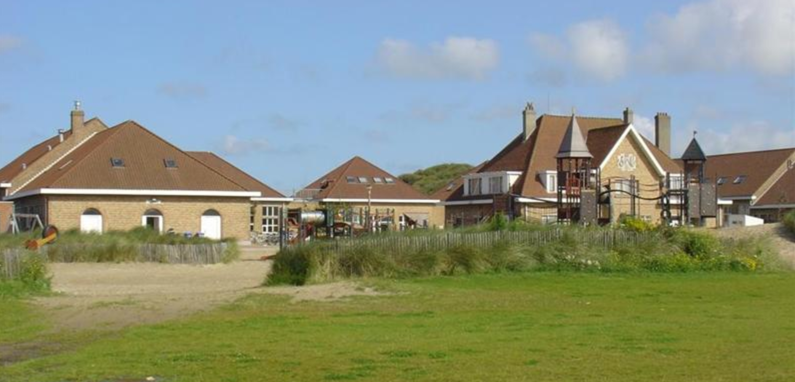

Bungalowpark ‘Zee en Duin’ verhuurt bungalows aan hun gasten. Van de huisjes worden een id, een unieke naam en het type vastgelegd. Onder type wordt de grootte van het huisje verstaan. Er zijn huisjes voor 8, 6 en 4 personen beschikbaar voor de verhuur. Van ieder type wordt het id, het aantal personen en de weekprijs vastgelegd. 

Gasten kunnen bungalows uitsluitend voor de periode van een week huren. Van de gast die de reservering boekt, wordt het id, gebruikersnaam en wachtwoord vastgelegd. Van iedere boeking wordt een id vastgelegd, het id van de gast, het id van de bungalow en de gewenste week. Is een langer verblijf gewenst door de klant, dient deze voor iedere week een aparte boeking aan te maken.

Gasten kunnen op de site inloggen om hun reservering te bekijken en eventueel aanpassen: onder aanpassen wordt hier verstaan een andere week inplannen, een week erbij boeken of een ander type huisje reserveren. Dit alles natuurlijk alleen als er nog huisjes beschikbaar zijn.

## Gevraagd

Maak een webapplicatie, om de gegevens bij te houden van gasten en boekingen zoals hierboven beschreven. Het is een DUO-opdracht.

## Tips

- Gebruik KISS (hier Keep it Small en Simple), uitbreiden kan altijd nog.
- Kijk goed naar de al beschikbare code, het wiel hoeft niet opnieuw uitgevonden te worden.
- Zorg voor een goede planning en samenwerking!

## Planning

#### WC 6
Regel de IDE en de ontwikkelomgeving. Inventariseer welke bestanden nodig zijn (py en html) en bedenk het ontwerp en de vormgeving van de site. 

#### WC 7
Maak de belangrijkste bestanden `__init__py`, `models.py` en `app.py` aan.
Daarnaast kunnen `base.html` en `home.html` nu ook aangemaakt worden in de folder templates (in `base.html` wordt de navigatiebalk opgezet, denk hier goed over na).
Maak ook templates voor de andere pagina's uit je ontwerp

Test de werking en met name de interactie van de site.

#### WC 8
Maak per model (tabel) de bestanden `forms.py` en `views.py` aan.
Maak ook in de folder templates aan met de specifiek voor dat model beschikbare html-bestanden. Zorg ervoor dat de betreffende data via de website benaderd en eventueel aangepast kan worden.

#### WC 9
Zorg voor een inlogsysteem en dat specifieke onderwerpen alleen voor ingelogde gasten beschikbaar is.

