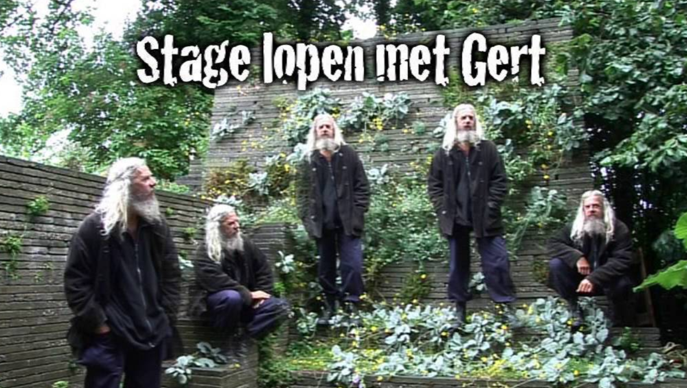

Binnen het HBO-onderwijs spelen stages een belangrijke rol. Het is daarom ook belangrijk om de gegevens van de stages goed vast te leggen. 

Doel van deze opdracht is om hier een sterk vereenvoudigde webapplicatie aan te maken. De database zal beperkt worden tot een viertal tabellen die maar een paar attributen gaan bevatten.

In de database worden maar vier tabellen opgenomen.

De tabel student kent drie kenmerken, id van de student, voornaam en achternaam.

De tabel instelling kent ook drie karakteristieken, id, naam van de instelling, soort instelling, ICT of marketing.

Ook de tabel begeleider heeft een drietal eigenschappen nodig, id, voor- en achternaam van de begeleider.

De vierde en laatste tabel is tevens de meest omvattende, maar liefst 6 features, id, id van de student, id van de instelling, id van de begeleider, cijfer en periode, bijv. semester 1 2021.

Er zijn twee typen geregistreerde bezoekers van deze site. Allereerst studenten, die de gegevens van hun stages kunnen inzien. Ten tweede de administratief medewerkers, die gegevens van stages kunnen toevoegen, aanpassen, of verwijderen. Bezoekers die niet zijn ingelogd kunnen alleen het stage-aanbod bekijken en hun interesse voor een stage kenbaar maken.

## Gevraagd

Maak de website waarbij deze gegevens kunnen worden geraadpleegd en bewerkt. Het is een DUO-opdracht. 

## Tips

- Gebruik KISS (hier Keep it Small en Simple), uitbreiden kan altijd nog.
- Kijk goed naar de al beschikbare code, het wiel hoeft niet opnieuw uitgevonden te worden.
- Zorg voor een goede planning en samenwerking!

## Planning

#### WC 6
Regel de IDE en de ontwikkelomgeving. Inventariseer welke bestanden nodig zijn (py en html) en bedenk het ontwerp en de vormgeving van de site. 

#### WC 7
Maak de belangrijkste bestanden `__init__py`, `models.py` en `app.py` aan.
Daarnaast kunnen `base.html` en `home.html` nu ook aangemaakt worden in de folder templates (in `base.html` wordt de navigatiebalk opgezet, denk hier goed over na).
Maak ook templates voor de andere pagina's uit je ontwerp

Test de werking en met name de interactie van de site.

#### WC 8
Maak per model (tabel) de bestanden `forms.py` en `views.py` aan.
Maak ook in de folder templates aan met de specifiek voor dat model beschikbare html-bestanden. Zorg ervoor dat de betreffende data via de website benaderd en eventueel aangepast kan worden.

#### WC 9
Zorg voor een inlogsysteem en dat specifieke onderwerpen alleen voor ingelogde bezoekers beschikbaar is.

