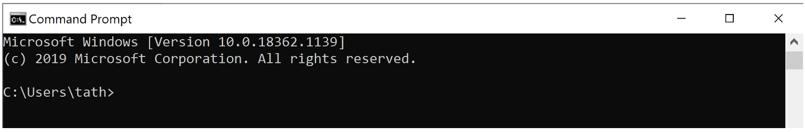
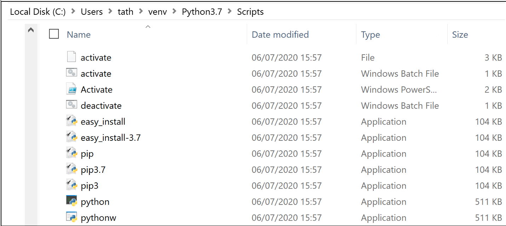
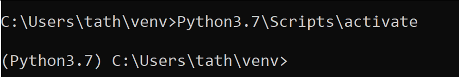
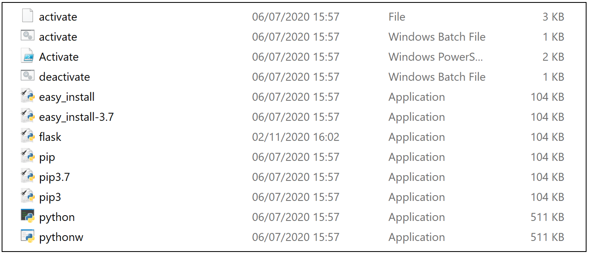

# Flask – Installatie

Er zijn meerdere manieren om Flask te installeren en er gelijk mee te kunnen werken. Hier wordt de meest eenvoudige wijze getoond waarbij we gebruik maken van een *virtuele omgeving*.

## Wat is een virtuele omgeving?

In de kern is het belangrijkste doel van virtuele Python-omgevingen het creëren van een geïsoleerde omgeving voor Python-projecten. Dit betekent dat elk project zijn eigen afhankelijkheden kan hebben, ongeacht welke afhankelijkheden elk ander project heeft. Het mooie hiervan is dat er geen limieten zijn aan het aantal omgevingen, aangezien het slechts mappen zijn met een paar scripts. Bovendien kunnen ze eenvoudig worden gemaakt met de opdrachtregelprogramma's `virtualenv` of `pyenv`.

## Stappenplan installatie:

### Stap 1: open een command line



!!! Info "Command line"
    In thema 1.1 en 1.2 hebben we ook al gewerkt met een command line. Op Mac OS-X kun je eenvoudig het programma *Terminal* openen. Binnen Windows typ je 'CMD' op de Command Line. In beide gevallen kom je standaard in je home-directory (`~/`) terecht.

### Stap 2: de werk-directory

Maak een directory aan binnen deze folder en maak deze nieuwe directory actief. In het voorbeeld hieronder geven we de nieuwe directory de naam `venv`, maar je kunt hem elke naam geven die je wilt (`webtech` zou bijvoorbeeld ook handig zijn):

```console
~ $> mkdir venv
~ $> cd venv
~/venv $>
```

### Stap 3: het aanmaken van een virtuele omgeving.

```console
$~/venv/> virtualenv Python3.7
```

Op de plaats van `Python3.7` mag iedere gewenste omgevingsnaam gebruikt worden. Nadat het commando is ingegeven en er op `<ENTER>` is geklikt duurt het geruime tijd voordat de volgende regel in beeld komt. Er wordt in de tussentijd van alles geïnstalleerd.

Er is een virtuele omgeving aangemaakt met de naam Python3.7 en in die folder zijn een aantal folders en bestanden neergezet. De map `Scripts` laat het volgende zien:



Een flink rijtje bestanden, maar ongelukkigerwijze ontbreekt Flask nog. Om dat te kunnen installeren moeten we eerst onze nieuwe virtuele omgeving activeren.

### Stap 4: het activeren van de virtuele omgeving.

In OS-X of Linux:

```console
~/venv $> source Python3.7/bin/activate
(Python3.7)~/venv $>
```

In Windows:



### Stap 5: toevoegen module Flask.

Om de module Flask te installeren maken we gebruik van `Python Package Installer`, oftewel [`pip`](https://pypi.org/project/pip/).

```console
(Python3.7)~/venv $> pip install flask
```

Er wordt weer hard gewerkt achter de schermen en het eindresultaat mag er weer zijn.



Om te testen of het installeren goed is gegaan, proberen we het te importeren in de interactieve python-shell:

```console hl_lines="5"
(Python3.7)~/venv $> python
Python 3.7.6 (default, Dec 30 2019, 19:38:28)
[Clang 11.0.0 (clang-1100.0.33.16)] on darwin
Type "help", "copyright", "credits" or "license" for more information.
>>> import flask
>>> flask.__version__
'1.1.2'
>>>
```

## Afsluiten van de virtuele omgeving

Een gebruikelijke manier om de virtuele omgeving af te sluiten is met:

```console
(Python3.7)~/venv $> deactivate
~/venv $>
```


