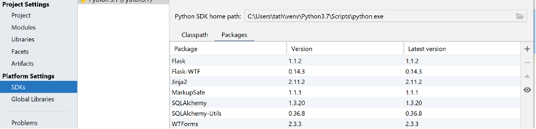
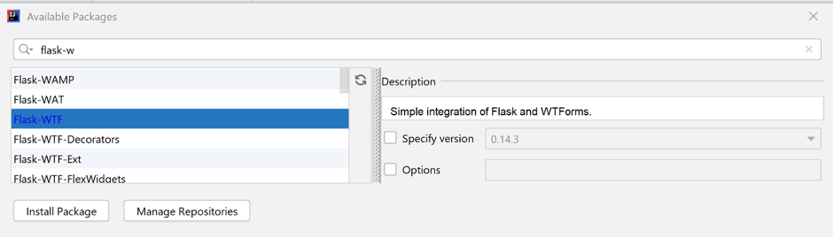

# Flask - een basis Flask formulier

In dit deel ligt de focus op de pakketten  flask_wtf en wtforms en op welke wijze waarop deze gebruikt kunnen worden om snel formulieren te maken op basis van de Flask-Python-scripts.

Maar als eerste een bespreking van de belangrijkste componenten bespreken voor het maken van een formulier.
Dat zijn de volgende onderdelen:

- Configureer een secret key voor de beveiliging.
- Maak een WTForm-klasse aan.
    - Ontwerp velden voor alle onderdelen op het formulier.
- Stel een View Function in (weergavefunctie).
    - Voeg methoden toe = [`GET`, `POST`].
    - Maak een instantie van Form Class aan.
    - Verwerk het formulier.

Om deze materie te kunnen begrijpen volgt nu een uitgebreid voorbeeld. Dit voorbeeld bestaat uit een Python-file (`Basis-Flask-form.py`) en een enkele HTML-file, getiteld `home.html`. Dit HTML-bestand wordt weer opgenomen in de folder ‘templates’.

Als eerste de Python-file. Er moeten nu meerdere zaken worden geïmporteerd, zie onderstaand kader.

```python
from flask import Flask, render_template
from flask_wtf import FlaskForm
from wtforms import StringField,SubmitField

app = Flask(__name__)
```

Even een korte uitleg. FlaskForm is een klasse waarvan overerft wordt om onze eigen formulieren te kunnen maken. De daaropvolgende regel geeft aan welke velden er gebruikt worden op de formulieren. Voor het basisformulier wordt hier aangegeven dat er Stringfields en SubmitFields gebruik gaan worden.
De laatste regel zorgt er weer voor dat de applicatie gecreëerd wordt.

Het kan zijn dat de pakketten `flask.wtf `en `wtforms` nog niet geïnstalleerd zijn. Dat kan snel verholpen worden. Hier wordt het gedaan met IntelliJ. Navigeer dan naar File | Project Structure. Selecteer SDKs onder het kopje Platform Settings en klik op de tab Packages.



Uit dit overzicht kan afgelezen worden dat de gevraagde pakketten al geïnstalleerd zijn. Komen ze nog niet in het rijtje voor, klik op het plus-teken. Er verschijnt een enorme lijst met beschikbare packages. Kies de juiste eruit en klik op ‘Install Package’.



Nadat de installatie van de applicatie is de volgende stap het configureren van een geheime `SECRET_KEY`. Hier is het ter demonstratie, maar later wordt er echt veel meer aandacht aan besteed en zullen er betere manieren aangeleerd worden om dit te doen.

```python
app.config['SECRET_KEY'] = 'mijngeheimesleutel'
```

De volgende stap is het aanmaken van een klasse `InfoForm`, een subklasse van `FlaskForm`. 

```python
class InfoForm(FlaskForm):
```

Op het formulier komen een tweetal velden te staan: een `StringField` genaamd instrument, en een `SubmitField`, een knop met het opschrift ‘Verzend’.

```python
class InfoForm(FlaskForm):

    instrument = StringField('Welk instrument wil je graag leren bespelen?')
    submit = SubmitField('Verzend')
```

Wanneer alle voorbereidingen zijn getroffen, kan de viewfunctie aangemaakt worden. Standaard wordt de eerste view doorgelinkt naar de indexpagina.

```python
@app.route('/', methods=['GET', 'POST'])
def index():    
```

Aan de functie worden de parametermethoden `GET` en `POST `meegegeven. Deze zorgen ervoor dat het mogelijk wordt om de ingevoerde gegevens door te geven aan een template, in dit geval `home.html`.
De waarde van de variabele `instrument` krijgt de status `False` mee, omdat deze aan het begin van het programma nog geen waarde heeft meegekregen. Dat gaat veranderen wanneer het formulier is ingevuld.

```python
instrument = False
# Maak een object van de klasse InfoForm aan.
form = InfoForm()
# Als het formulier valide is
if form.validate_on_submit():
        # Haal de data voor instrument op uit het formulier.
        instrument = form.instrument.data
        # Zet de waarde voor de variabele instrument op het formulier weer op False
        form.instrument.data = ''
    return render_template('home.html', form=form, instrument=instrument)
```
Op het valide zijn wordt nog nader ingegaan. 

En tot slot natuurlijk weer:

```python
if __name__ == '__main__':
    app.run(debug=True)
```

in `home.html` moet natuurlijk ook code staan. Eerst de bovenste helft:

```html
<p>
    
    Het instrument van jouw keuze is {{instrument}}.
    <br>De keuze kan gewijzigd worden in onderstaand formulier:
    
    Geef de naam van een instrument op in dit formulier:
    
</p>
```

Als `home.html` wordt aangeroepen heeft de variabele `instrument` nog altijd de waarde `False`. De voorwaarde achter de `if` is dan niet waar en er wordt overgegaan naar het `else`-blok, waar gevraagd wordt om de naam van een instrument in te geven.

De tweede helft ziet er als volgt uit:

```html
<form method="POST">
    {{ form.hidden_tag() }}
    {{ form.instrument.label }} {{ form.instrument() }}
    {{ form.submit() }}
</form>
```

Bij het runnen van de applicatie wordt het volgende scherm zichtbaar:


Conform de basisinstellingen van de klasse InfoForm heeft `instrument` de waarde `False`. Bij een klik op de button ‘Verzend’ wordt `home.html` aangeroepen. Voor die tijd is als instrument ‘Gitaar’ ingevuld. Bij de aanroep worden het formulier als ook de opgegeven waarde voor `instrument `meegestuurd.


Het bovenste gedeelte van de code van `home.html` draagt zorg voor de eerste twee regels van de output. De onderste helft stelt het formulier nogmaals ter beschikking om een ander instrument te kiezen.

Wanneer er geen `SECRET_KEY` wordt opgenomen in de Python-file ontstaat er bij het runnen een foutmelding. Deze is dus vereist evenals de hidden tag.
