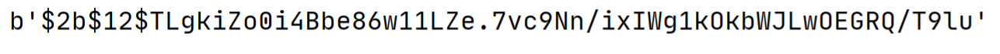
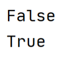
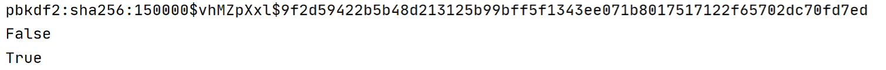

# User authentication - Hashing

De titel van dit deel is User authentication. Gelijk weer een omschrijving in het Engels. Vertaald naar eenvoudig Nederlands levert dat het begrip gebruikersverificatie op. Hiermee wordt bedoeld dat voordat een gebruiker toegang wordt verleend op een aanvraag er een procedure wordt opgestart om te bepalen of het een rechtmatige aanvraag betreft.

Kortweg, het draait om het inloggen.
Tot nu toe heeft iedereen toegang gehad tot elke pagina van de ontwikkelde webapplicaties. Vaak is het wenselijk de toegang te beperken tot alleen geregistreerde gebruikers. Het gaat in dit deel om de autorisatie en authenticatie van de gebruikers.

De onderwerpen die we gaan behandelen zijn:

- Password hashing;
- `Flask-Login` library

Als een website gebruikersverificatie kent, zijn wachtwoorden en gebruikersnamen opgeslagen in een database. Om veiligheidsredenen zal nooit de letterlijke inhoud van het wachtwoord worden opgeslagen. Dat is te gemakkelijk te achterhalen voor hackers.

Een hashfunctie brengt hierbij uitkomst. Het is een algoritme dat een wachtwoord kan omtoveren naar een veilig alternatief. En met veilig wordt bedoeld dat een buitenstaander uit de hash niet kan achterhalen wat het originele wachtwoord is.

In de praktijk werkt dat als volgt: als een gebruiker een wachtwoord invoert, kan dit eenvoudig vergeleken worden met de opgeslagen hash.

Hier kan uit een tweetal beschikbare handige bibliotheken gekozen worden:

- [`Bcrypt`]()
- [`Werkzeug`]()
  
Beiden kunnen zeer goed gebruikt worden in een Flask-applicatie om te kunnen achterhalen of er een juist wachtwoord is ingevoerd. Van beide pakketten wordt een voorbeeld gegeven hoe het gebruikt kan worden. 

`Bcrypt` en `Werkzeug` komen vaak mee als `Flask` geïnstalleerd wordt. Is dat niet het geval kunnen de pakketten [op de bekende wijze](../week5/flask-forms-deel1.md) opgehaald worden.

## Bcrypt

Is Bcrypt aanwezig, is de eerste actie het importeren ervan:

```python
from flask_bcrypt import Bcrypt
```

De tweede actie is om een object van de klasse aan te maken:

```python
bcrypt = Bcrypt()
```

Het opslaan van het wachtwoord in een hash-vorm gebeurt als volgt.
Als wachtwoord wordt `supergeheimwachtwoord` gebruikt.

```python
hashed_pass = bcrypt.generate_password_hash('supergeheimwachtwoord')
print(hashed_pass)
```

Het wachtwoord wordt gehashed en bewaard in de variabele `hashed_pass`. Nadat het geprint is, is het echt niet meer te herleiden naar het origineel:



Wordt het runnen herhaald, verschijnt een er andere hash.

Uiteraard nu weer een test naar de werking.

```python
fout_check = bcrypt.check_password_hash(hashed_pass, 'verkeerdwachtwoord')
print(fout_check)
goed_check = bcrypt.check_password_hash(hashed_pass, 'supergeheimwachtwoord')
print(goed_check)
```

Het effect:



Precies in de lijn der verwachting.

## Werkzeug

Dit kan een stuk sneller gedaan worden. Het is weer meer van hetzelfde.

```python
from werkzeug.security import generate_password_hash,check_password_hash

hashed_pass = generate_password_hash('supergeheimwachtwoord')
print(hashed_pass)
fout_check = check_password_hash(hashed_pass,'verkeerdwachtwoord')
print(fout_check)
goed_check = check_password_hash(hashed_pass,'supergeheimwachtwoord')
print(goed_check)
```


En het effect:




Het verschil tussen beiden is dat bij Werkzeug exact de juiste methoden binnengehaald worden en bij Bcrypt moet er soms een beetje over nagedacht worden. De keuze tussen deze pakketten is vrij aan de ontwikkelaar.


